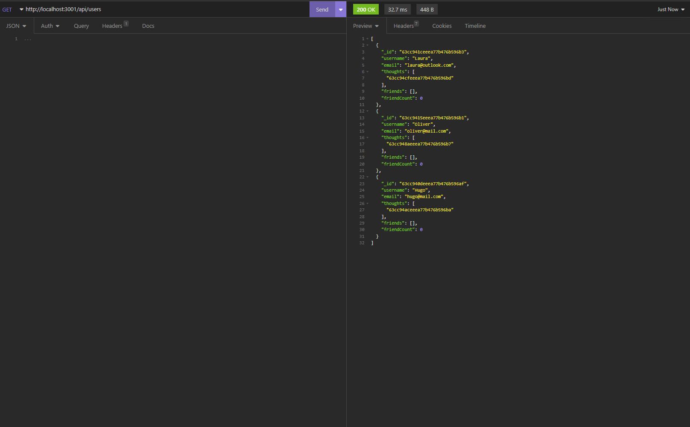

# Social Network API

## Description

API for a social network web application where users can share their thoughts, react to friends' thoughts, and create a friend list.

## Screenshots

## Technology Used
- Node.js
- MongoDB
- Mongoose
- JavaScript
- Express.js

## Contact

App GitHub Link - https://github.com/Hugooloya/18-Social-Network-API
Video walkthrough - https://drive.google.com/file/d/1xqkIglzH620OG928AVrtts8F4HLOQ6ct/view